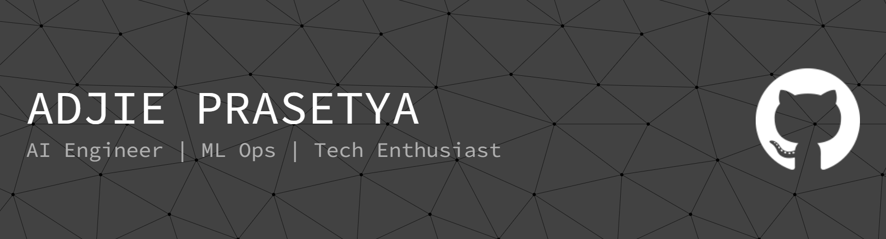

## 🧠 `About Me`

```text
name        : Adjie Prasetya
role        : AI Engineer · ML Ops
university  : Tanjungpura University
major       : Informatics (2nd Year)
location    : Pontianak, West Kalimantan, Indonesia 🇮🇩

currently   :
  building  : Pothole Detection for SDI Prediction in PKRMS, AI Meeting Assistant with Diarization & Task Extraction
  exploring : Deep Learning, Pytorch, Pretrained Models, Fine Tuning, Local LLMs, Object Detection
  open_to   : Collaborations, open-source contributions, freelance works
```

> *"Passionate about building end-to-end AI solutions —
> from experimenting with deep learning and object detection in PyTorch
> to deploying scalable machine learning workflows."*

---


# 💻 Tech Stack:
          


---

## 📊 GitHub Stats
<div align="center">
  


</div>

## 🐍 Contribution Snake
<div align="center">
<picture>
  <source media="(prefers-color-scheme: dark)"
    srcset="https://raw.githubusercontent.com/AdjiePrasetya/AdjiePrasetya/output/github-contribution-grid-snake-dark.svg" />
  <source media="(prefers-color-scheme: light)"
    srcset="https://raw.githubusercontent.com/AdjiePrasetya/AdjiePrasetya/output/github-contribution-grid-snake.svg" />
  
</picture>
</div>

## 🏆 Trophies

<div align="center">

<!-- [](https://github.com/ryo-ma/github-profile-trophy) -->

<!-- or -->

[](https://github.com/lucthienphong1120/github-trophies)

</div>

## 🌐 Connect
<div align="center">

[](https://instagram.com/jiprsty4) 
[](https://linkedin.com/in/ajiii) 
[](https://x.com/__kn0wn__) 
[](mailto:adjie0915@gmail.com)

</div>

---

<div align="center">
  

*`> Coding the world we want to live in.`*

</div>

