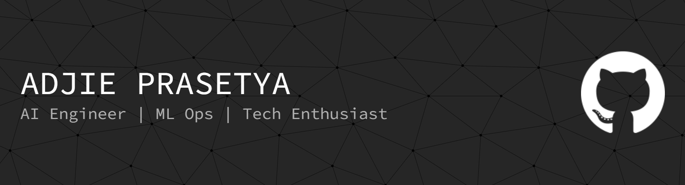

# **About Me**
- 📚 Studies Informatics at [Universitas Tanjungpura](https://untan.ac.id/)
- 🤖 Passionate about Machine Learning, Computer Vision, NLP, Data Analysis, and Low-Level Programming
- 🔬 I enjoy working at the intersection of research and application
- 🌱 Always eager to learn, contribute to open-source projects, and collaborate with other passionate minds in the tech community
Feel free to check out my projects, connect with me, or reach out for collaborations!

## 🌐 Socials:
     

# 💻 Tech Stack:
          

## 📊 GitHub Stats

  

